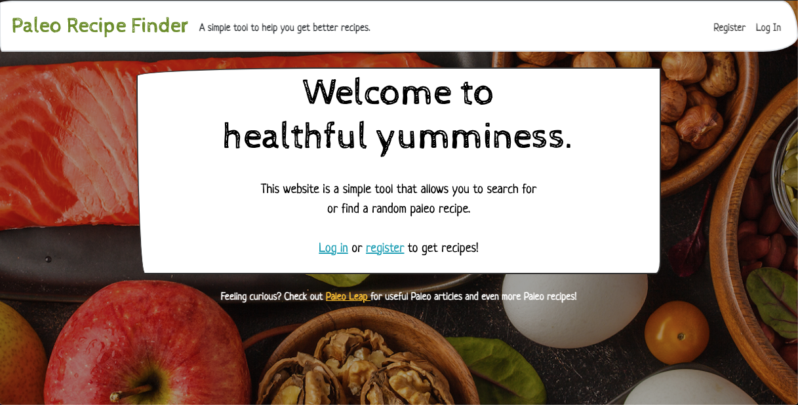
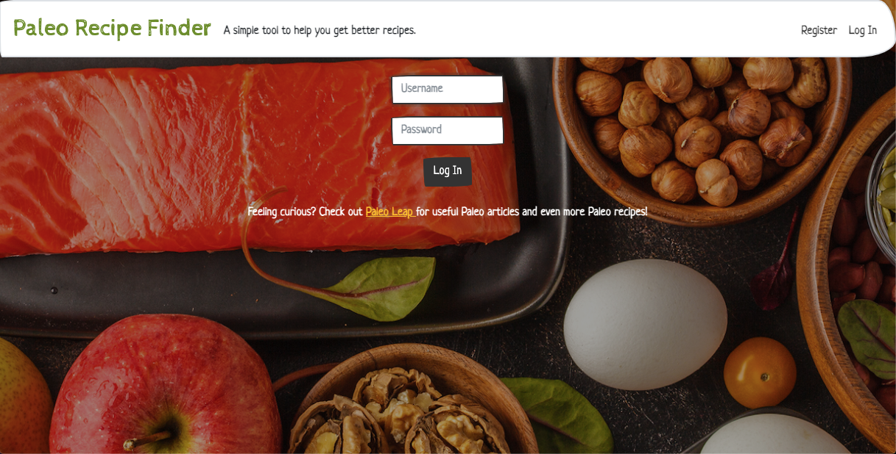
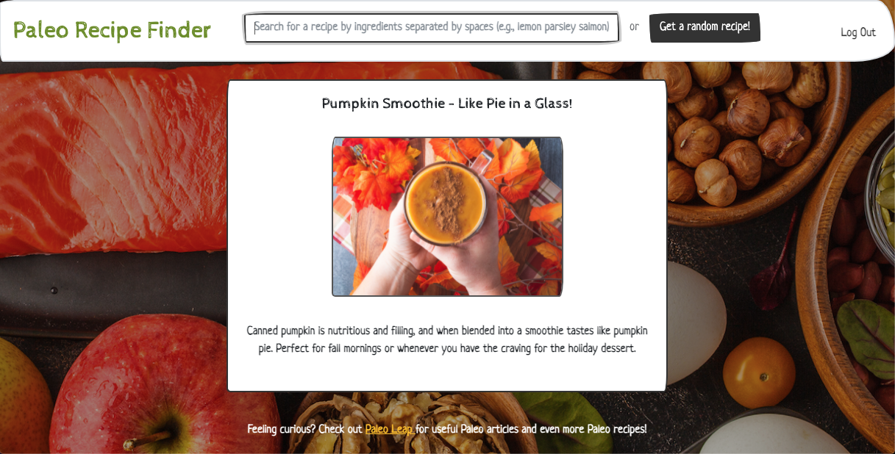
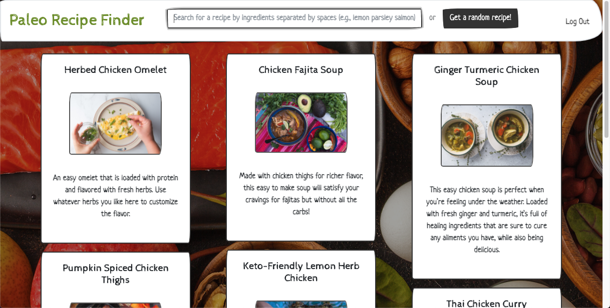
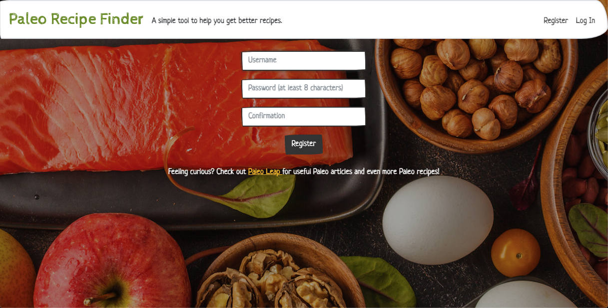
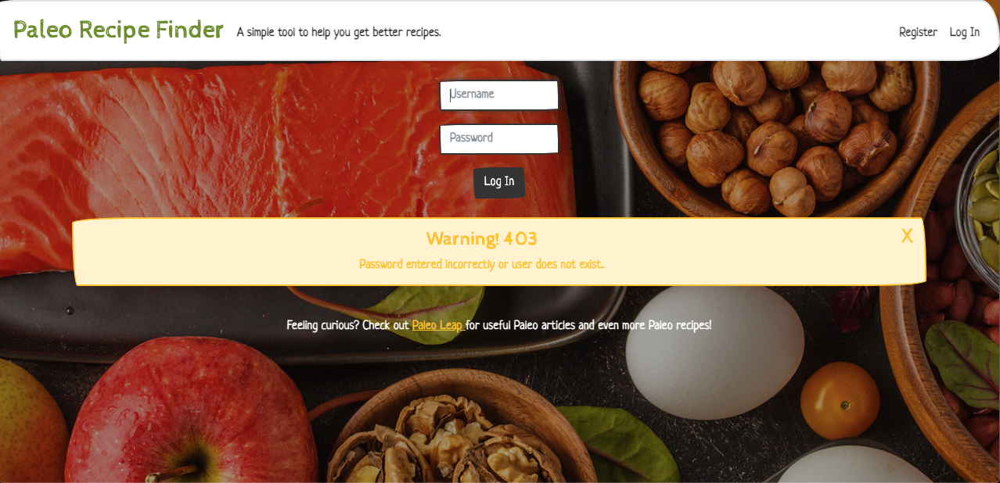

# **Recipe Discovery Website**

# Description
Also known as "Paleo Recipe Finder," this is a web application with a frontend and a backend. Made using Python, Flask, SQLite, HTML, CSS, JavaScript, and Bootstrap.

Through this app, I can register as a user and search for or randomly find [paleo diet](https://www.mayoclinic.org/healthy-lifestyle/nutrition-and-healthy-eating/in-depth/paleo-diet/art-20111182) recipes, scraped from a website containing them.

I follow the paleo diet. The diet emphasizes whole, organic foods, while disregarding manufactured and processed foods.

Since I cook almost daily, you can see how I might find such an app useful.

Creating the app allowed me to work on my web development skills. It was my [final project](https://cs50.harvard.edu/x/2020/project/) for [Harvard CS50](https://cs50.harvard.edu/x/2020/). 

[Click here to watch a video demo of this app.](https://www.youtube.com/watch?v=yvhdFkytXWM)

Pictures of the application are below. Click them for larger versions.

#

# Project Files
The following links contain summary overviews of each file used in the project. Please refer to a file's code directly for specific implementation and details regarding that file.

* [application.py](#application.py)
* [helpers.py](#helpers.py)
* [finder.db](#finder.db)
* [Paleo Food.png](#Paleo-Food.png)
* [styles.css](#styles.css)
* [apology.html](#apology.html)
* [apology_login.html](#apology_login.html)
* [apology_register.html](#apology_register.html)
* [layout.html](#layout.html)
* [login.html](#login.html)
* [my_recipes.html](#my_recipes.html)
* [register.html](#register.html)
* [search_apology.html](#search_apology.html)
* [search_results.html](#search_results.html)

## application.py
This is the main application file that our API/web framework, Flask, will run from. We too use this file to interact with our
HTML files via Jinja. We also use it to program our user SQL database. It contains all of the backend, SQLite database code,
a helper function, a Recipe object class, and the `GET` and `POST` functionality behind our HTML.

## helpers.py
This is a helper file to `application.py`. It assists the CS50 distribution code used within `application.py` from a previous Flask project (CS50 Finance). All functions in
this file are required for the application to run even if I am only using one of the functions contained therein
(`login_required(f)`).

## finder.db
This is the database that stores our user information. We can read from and write to it via `application.py` when a user wants
to log in or register.

## drumstick.ico
This is the favicon (a chicken drumstick) for our website.

## Paleo Food.png
This is the background image for every page on the site.

## styles.css
This styles the HTML.

## apology.html
This really should be called `homepage.html`. It's called `apology.html` because the distribution code of CS50 Finance
makes it necessary (the index page *needs* to be called `apology.html`). It displays a
welcome page with options to log in or register.

## apology_login.html
This is an actual apology that displays an alert to the user if they incorrectly enter login information.

## apology_register.html
This is an actual apology that displays an alert to the user if they incorrectly enter registration information.

## find_results.html
This page displays recipe results after the user logs in and hits the "Get a random recipe!" button in the navbar.
It shows the recipe title, clickable image, and summary, all scraped from the recipe
[website](https://ultimatepaleoguide.com/recipes/#500+_Recipes_Counting!).

I went through several iterations of design before landing on this most simple one.

## layout.html
This is the page that all other pages rely on for their general look and scheme. It contains a Bootswatch theme,
[Sketchy](https://bootswatch.com/sketchy/), which I thoroughly enjoy, as well as some JavaScript for user alerts,
and a neat footer.

## login.html
This is the user login page.

## my_recipes.html
This is a page for a function (`save()`) I decided not to implement, wherein the user could save recipes to our
database to refer back to them later. Due to time constraints, I decided not to pursue it, though I
know doing so would involve Python pickling or ORM (Object-Relational Mapping). I've looked into SQLAlchemy.

## register.html
This is the user registration page.

## search_apology.html
This is an alert rendered to the user if no recipes are found matching their search or if they search without entering
any text.

## search_results.html
This is a page displaying all of the recipes matched to a user's search terms. It is a group of cards displaying chosen
recipe attributes (recipe title, image and link, summary) in a grid. 

I played around with different card schemes for
this one (including decks), but liked how groups displayed the most.

# License & Copyright
© Alex Guidace

Licensed under the [MIT License](License).
